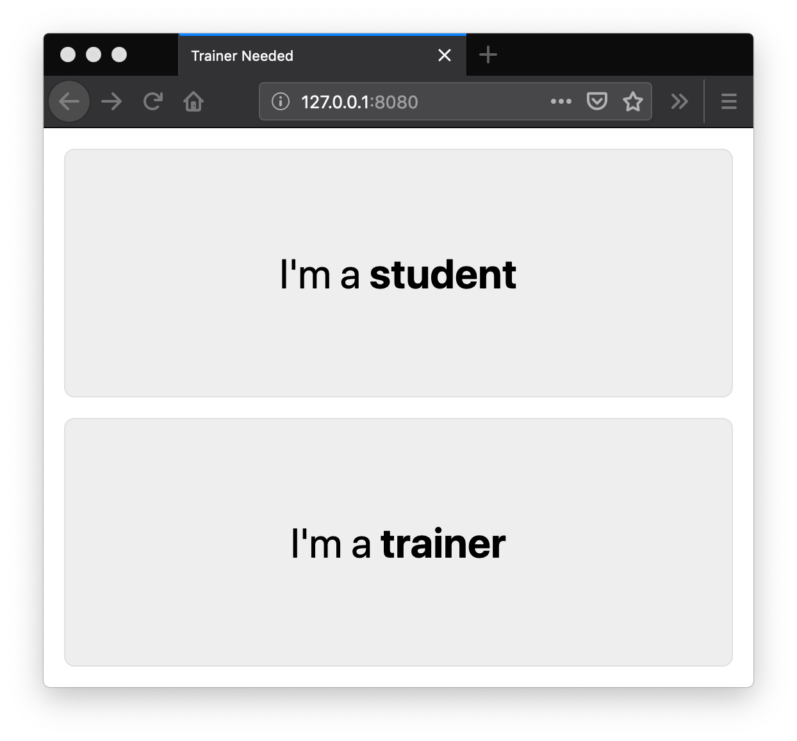
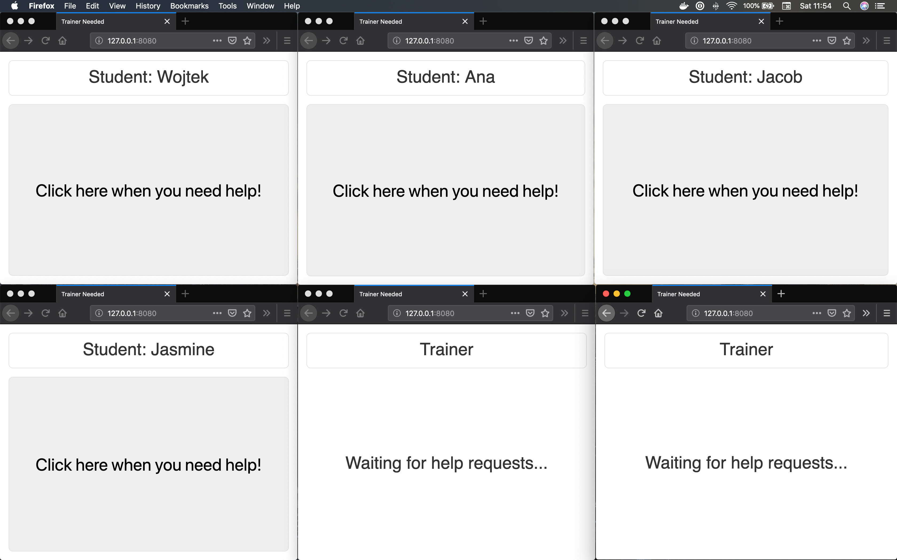
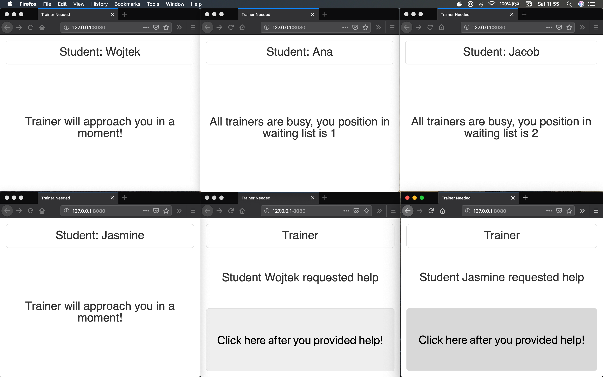
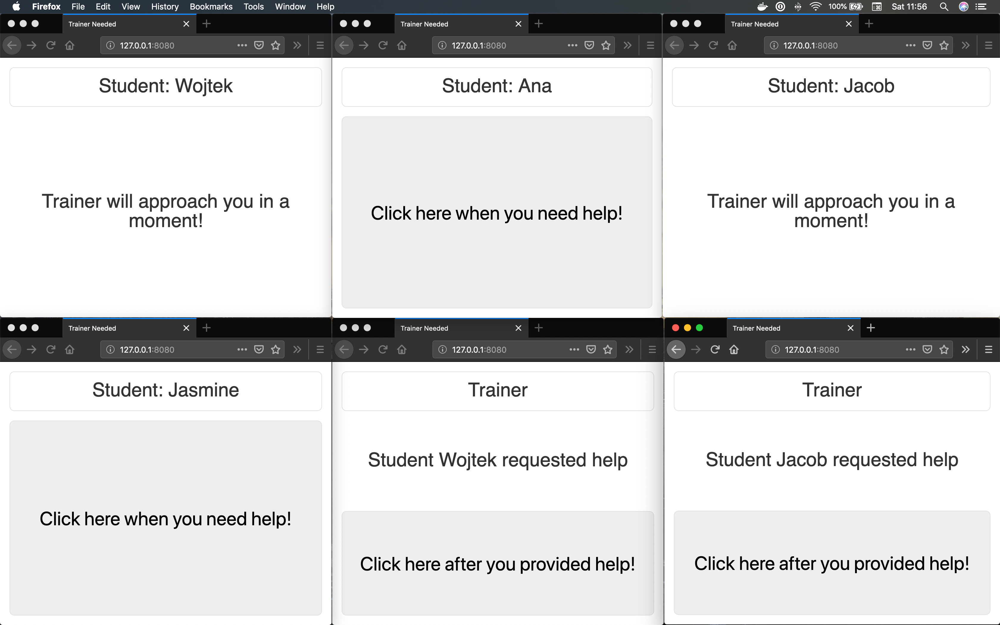

# Web sockets demo

I took part in a [WarsawJS](https://warsawjs.com/) workshop and here is the result. We experimented with
web sockets and  NodeJS tool. Pretty cool but no :fireworks: here, sorry :man_shrugging:

## How it works?

We build a software for running workshops with trainers ready to help
students. The assumption is to run the app as a chosen role and rely on it
to communicate during the workshop.

## First, choose the your role:


## Here is an example view with the selected roles and registered users:



## Then once the students start requesting help, trainers can physically approach and help them


## In the wild, the users' screens would look like this:


## Run
### Server side
#### Install

```sh
cd backend
npm install
```

#### Start the server

```sh
npm run start-server
```

### Client side
#### Install

```sh
cd frontend
npm install
```

#### Start the server

```sh
npm run start-client
```
